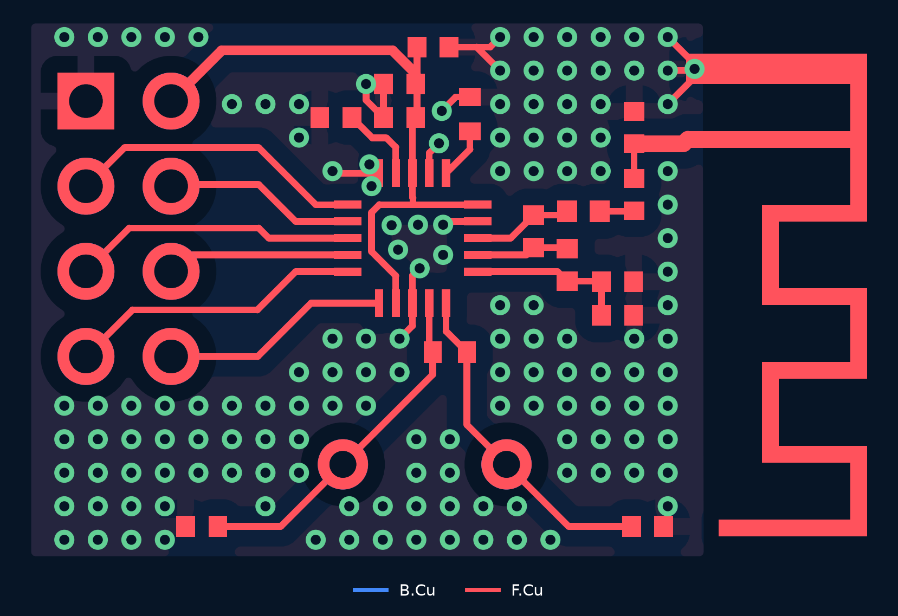
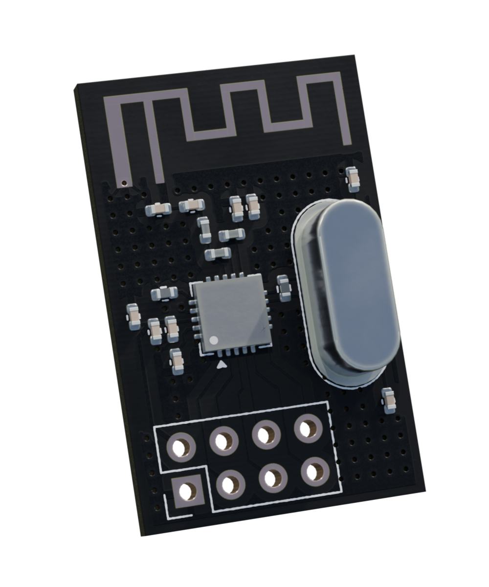

# Custom 2.4 GHz Radio Module

**A custom nRF24L01 radio PCB with a printed antenna, demonstrated in a STEM-club RC car across an approximately 30 m indoor test area.**

[PCB layout](#pcb-layout) · [Schematic](radio.kicad_sch) · [Bring-up examples](#radio-bring-up) · [RC-car system](https://github.com/Hung-Chi970104/rukus)

## PCB layout

*Copper overview rendered from the original KiCad file. Front copper is red; back copper is blue; vias are green. Silkscreen and fabrication layers are omitted.*

## What I built

- Designed and built a custom nRF24L01 transceiver PCB with a **meandered inverted-F trace antenna based on TI AN043**.
- Integrated the RF matching network, **16 MHz crystal** and supply decoupling with the printed antenna.
- Integrated the radio with the custom Rukus controller and demonstrated reliable RC-car control across an **approximately 30 m indoor test area**.

The indoor result is an observed RC-car demonstration, not a measured packet-loss or maximum-range specification.

## Original 3D render

## Design

| Block | Implementation |
|---|---|
| Radio | nRF24L01 2.4 GHz transceiver |
| Host connection | SPI plus CE and CSN control |
| Reference clock | 16 MHz crystal |
| RF path | Matching network and printed meandered inverted-F antenna |
| Antenna reference | [Texas Instruments AN043](https://www.ti.com/lit/an/swra117d/swra117d.pdf) |
| System demonstration | [Rukus RC car and videos](https://github.com/Hung-Chi970104/rukus#working-hardware) |

The antenna follows TI's reference geometry; this project does not claim TI's reference-board RF measurements as measurements of this PCB.

## Radio bring-up

The [transmitter](examples/transmitter.py) sends numbered messages and reports whether an acknowledgment arrives. The [receiver](examples/receiver.py) prints the received messages. These are original MicroPython examples copied from Rukus.

1. Install MicroPython and a compatible `nrf24l01.py` driver on each host.
2. Check wiring against the [schematic](radio.kicad_sch) before powering the board.
3. The examples use SPI 0: SCK GP2, MOSI GP3, MISO GP4, CSN GP5 and CE GP6. Adapt these to the actual host wiring.
4. Start the receiver before the transmitter. Both examples use the five-byte address `Node1`.
5. Observe transmitted messages, acknowledgment status and received text in the serial consoles.

The driver is a separate dependency; it is not bundled here. The examples test the radio link and are not the complete RC-car application.

## Files

| File | Purpose |
|---|---|
| [radio.kicad_pro](radio.kicad_pro) | KiCad project |
| [radio.kicad_sch](radio.kicad_sch) | Circuit schematic |
| [radio.kicad_pcb](radio.kicad_pcb) | Routed PCB and antenna geometry |
| [radio.pcb3d](radio.pcb3d) | Original 3D project asset |
| [production/](production/) | Original manufacturing export and netlist |
| [examples/](examples/) | Transmit / receive bring-up examples |

## Origin

Extracted from [Hung-Chi970104/rukus — radio/](https://github.com/Hung-Chi970104/rukus/tree/7c238e4ea9ec795f958542f99792d99c4606db71/radio). The circuit, PCB, manufacturing exports and original render are copied unchanged. Existing Rukus links continue to work; historical backup archives remain in that repository.

Designed and built by Hung-Chi Wang.
